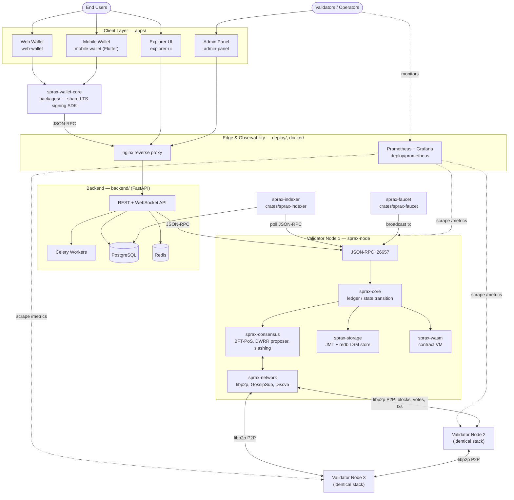

<div align="center">

# SPRX Protocol

**Scalable Protocol for Real-world X**

A Layer-1 blockchain built in Rust on a Cosmos SDK–inspired architecture — BFT-PoS consensus, native
CosmWasm-style smart contracts, and a full application layer (wallets, explorer, admin panel, indexer,
API backend) in one monorepo.

[](LICENSE)
[](rust-toolchain.toml)
[](docs/PROJECT_STATUS.md)

[Architecture](#architecture) · [Quickstart](#quickstart) · [Repository Layout](#repository-layout) · [Documentation](#documentation) · [Contributing](#contributing)

</div>

---

## Overview

SPRX (**S**calable **P**rotocol for **R**eal-world **X**), also called **Sprax Chain**, is a sovereign
Layer-1 blockchain combining:

- **CometBFT-style BFT-PoS consensus** — deterministic weighted round-robin proposer election, `RoundState`
  locking for Byzantine safety across round-changes, and slashing for double-signing/downtime.
- **A dual execution surface** — native state-transition logic in `sprax-core` plus a CosmWasm-flavored
  Rust smart contract VM (`sprax-wasm`) with reentrancy guards and gas metering.
- **A production application stack** — non-custodial web and mobile wallets, a block explorer, an
  operations admin panel, and a FastAPI backend/indexer, all wired to a live node over JSON-RPC.

The native asset is **SPRX** — see [Native Asset & Tokenomics](#native-asset--tokenomics) below.

> **Project status:** all 12 phases of the [multi-phase roadmap](docs/ROADMAP.md) — architecture through
> mainnet preparation — are marked complete in [docs/PROJECT_STATUS.md](docs/PROJECT_STATUS.md), with 58
> workspace tests passing across the 10 Rust crates. The protocol has **not** had an external third-party
> audit yet (see [docs/SECURITY_AUDIT.md](docs/SECURITY_AUDIT.md) and [docs/EXTERNAL_AUDIT_REPORT.md](docs/EXTERNAL_AUDIT_REPORT.md)); treat mainnet
> parameters as pre-audit.

---

## Architecture

Full-project view — end users and validator operators, the client apps, the backend services, one
validator node's internals, and the validator-to-validator P2P mesh:



10 Rust crates make up the chain itself:

| Crate | Responsibility |
|---|---|
| `sprax-types` | Core primitives — `Address` (Bech32/Hex), `Amount`, `ChainId`, `Hash32` |
| `sprax-crypto` | Ed25519 & Secp256k1 signing, Blake3/SHA-256 hashing, BIP-39/44 HD derivation |
| `sprax-storage` | Jellyfish Merkle Tree state commitments over a `redb`-backed LSM store |
| `sprax-network` | libp2p transport, GossipSub v1.1, Discv5 discovery, peer exchange |
| `sprax-consensus` | CometBFT-style BFT-PoS state machine, proposer election, staking, slashing |
| `sprax-core` | Ledger, state transitions, transaction/receipt processing, genesis |
| `sprax-node` | Daemon wiring consensus + network + storage + JSON-RPC server |
| `sprax-cli` | `sprax` binary — init, start, keys, tx, query, status |
| `sprax-wasm` | Smart contract execution engine (CW20-style tokens, escrow, governance) |
| `sprax-indexer` | Chain-follower indexing pipeline for the explorer/backend |
| `sprax-faucet` | Rate-limited testnet faucet service |

---

## Repository Layout

```
sprax-chain/
├── crates/              Rust workspace — the blockchain node and its subsystems
├── apps/
│   ├── web-wallet/       React + TypeScript non-custodial wallet (Vite)
│   ├── mobile-wallet/     Flutter non-custodial wallet (Android/iOS)
│   ├── explorer-ui/      React + TypeScript block explorer (Vite)
│   └── admin-panel/      React + TypeScript operations console (Vite)
├── packages/
│   └── sprax-wallet-core/ Shared TypeScript wallet SDK used by web + mobile
├── backend/               FastAPI REST/WebSocket API, Alembic migrations, Celery workers
├── deploy/                Devnet/testnet/mainnet Docker Compose stacks, genesis files, Prometheus, nginx
├── docker/                Node Dockerfile for local multi-node compose
├── scripts/               Local testnet orchestration, validator key generation, genesis verification
└── docs/                  Full technical specification suite (see below)
```

---

## Quickstart

### Prerequisites

- Rust `1.80+` (see [rust-toolchain.toml](rust-toolchain.toml))
- Node.js `18+` and a package manager for the `apps/*` frontends
- Python `3.11+` for the backend
- Docker + Docker Compose (optional, for a multi-node/full-stack run)

### 1. Run a single local node

```bash
cargo build --release -p sprax-cli
./target/release/sprax init --chain-id sprax-devnet-1 --home .sprx
./target/release/sprax start --home .sprx --rpc-port 26657 --p2p-port 26656
```

### 2. Run a local 3-node devnet

```bash
# bash
./scripts/run_local_testnet.sh

# PowerShell
./scripts/run_local_testnet.ps1
```

### 3. Run the full stack with Docker Compose

```bash
cp .env.example .env
docker compose up --build          # 3-node chain devnet (root docker-compose.yml)
docker compose -f backend/docker-compose.backend.yml up --build   # API + Postgres + Redis
```

See [deploy/](deploy/) for dedicated testnet and mainnet Compose stacks, and [docs/TESTNET_GUIDE.md](docs/TESTNET_GUIDE.md)
for connecting to the public testnet.

### 4. Run the backend API

```bash
cd backend
pip install -e ".[dev]"
alembic upgrade head
uvicorn app.main:app --reload
```

### 5. Run a frontend app

```bash
cd apps/explorer-ui   # or apps/web-wallet, apps/admin-panel
npm install
npm run dev
```

### 6. Send a transaction with the CLI

```bash
./target/release/sprax keys add alice --home .sprx
./target/release/sprax tx send --from alice --to <bech32-address> --amount 1000000000000000000 --home .sprx
./target/release/sprax query balance <bech32-address> --home .sprx
```

---

## Native Asset & Tokenomics

- **Symbol**: `SPRX`
- **Name**: Scalable Protocol for Real-world X
- **Nature**: Freely floating Layer-1 cryptocurrency (**not** a fixed-price or fiat-pegged stablecoin)
- **Precision**: 18 decimals (`1 SPRX = 10^18 atto-SPRX`)
- **Supply**: 1,000,000,000 SPRX genesis supply (see [docs/GENESIS.md](docs/GENESIS.md))
- **Monetary policy**: dynamic inflation curve + EIP-1559-style base-fee burn + staking yield (see [docs/TOKENOMICS.md](docs/TOKENOMICS.md))
- **Fiat display**: real-time ₹ INR / $ USD / € EUR / £ GBP / ¥ JPY valuation via decentralized oracle
  price aggregation at the wallet and explorer presentation layers (display-only — the chain itself has
  no fiat peg)

---

## Documentation

The full technical specification lives in [docs/](docs/). Start here:

| # | Document | Covers |
|---|---|---|
| 1 | [Framework Selection & ADR-001](docs/FRAMEWORK_SELECTION.md) | 16-dimension comparative analysis; Cosmos SDK + CometBFT + CosmWasm Rust + EVM |
| 2 | [Master System Architecture](docs/ARCHITECTURE.md) | 20 architectural pillars, node topologies, multi-currency abstraction |
| 3 | [Consensus & Mathematical Spec](docs/CONSENSUS.md) | BFT-PoS mechanics, voting power, DWRR proposer election, BFT-time, slashing |
| 4 | [P2P Networking Spec](docs/NETWORK.md) | libp2p, QUIC/TCP, Noise encryption, Discv5, GossipSub, sentry architecture |
| 5 | [Storage & State Commitments](docs/STORAGE.md) | Jellyfish Merkle Tree, redb LSM state store, WAL, pruning |
| 6 | [Security Architecture & Threat Matrix](docs/SECURITY.md) | Categorized threat matrix, crypto standards, validator HSM key hygiene |
| 7 | [Tokenomics](docs/TOKENOMICS.md) | Native SPRX economics, inflation, base-fee burn, staking yield |
| 8 | [Governance](docs/GOVERNANCE.md) | Proposal lifecycle, voting math, quorum/veto thresholds, timelocks |
| 9 | [Upgradeability](docs/UPGRADEABILITY.md) | State migration hooks, smart contract proxy architecture |
| 10 | [Technology Decision Matrix](docs/TECH_STACK.md) | Cosmos SDK vs. Substrate vs. custom Rust L1 vs. EVM rollups vs. Solana SVM |
| 11 | [Roadmap](docs/ROADMAP.md) | 6-phase engineering lifecycle from architecture to mainnet genesis |
| — | [Project Status Matrix](docs/PROJECT_STATUS.md) | Current phase-by-phase completion and test verification |
| — | [Developer Guide](docs/DEVELOPER_GUIDE.md) / [Coding Standards](docs/CODING_STANDARDS.md) | Day-to-day contributor workflow |
| — | [Smart Contracts](docs/SMART_CONTRACTS.md) / [Contract Security](docs/CONTRACT_SECURITY.md) | WASM VM, contract patterns, security posture |
| — | [Wallet Architecture](docs/WALLET_ARCHITECTURE.md) / [Wallet Security](docs/WALLET_SECURITY.md) | Key management, HD derivation, recovery |
| — | [Validators](docs/VALIDATORS.md) / [Slashing](docs/SLASHING.md) / [Validator Onboarding](docs/VALIDATOR_ONBOARDING.md) | Running and operating a validator |
| — | [Testnet Guide](docs/TESTNET_GUIDE.md) / [Mainnet](docs/MAINNET.md) / [Genesis](docs/GENESIS.md) | Network participation |

The full index (60+ documents covering explorer, indexer, admin panel, monitoring, disaster recovery,
incident response, and more) is in [docs/](docs/).

---

## Testing

```bash
cargo test --workspace              # Rust chain (58 tests across 10 crates)
cd backend && pytest                # Backend API
cd apps/explorer-ui && npm run test # Explorer UI
cd apps/admin-panel && npm run test # Admin panel
```

CI is defined in [.github/workflows/](.github/workflows/).

---

## Security

- Report vulnerabilities per [docs/BUG_BOUNTY.md](docs/BUG_BOUNTY.md) — **do not** open a public issue for
  a security-sensitive finding.
- See [docs/SECURITY.md](docs/SECURITY.md), [docs/THREAT_MODEL.md](docs/THREAT_MODEL.md), and
  [docs/INCIDENT_RESPONSE.md](docs/INCIDENT_RESPONSE.md) for the current threat model and response process.
- Consensus-critical code (`sprax-consensus`, `sprax-core` state transitions, block/tx serialization),
  genesis parameters, and validator economics require design discussion before a PR — see
  [CONTRIBUTING.md](CONTRIBUTING.md).

---

## Contributing

Contributions are welcome — read [CONTRIBUTING.md](CONTRIBUTING.md) first for the monorepo layout, coding
standards, and review process. Never commit secrets, seed phrases, or private keys (including test/demo
ones); see `.env.example` for what belongs in an untracked `.env`.

## License

Dual-licensed under your choice of [Apache License 2.0](LICENSE) or MIT.
