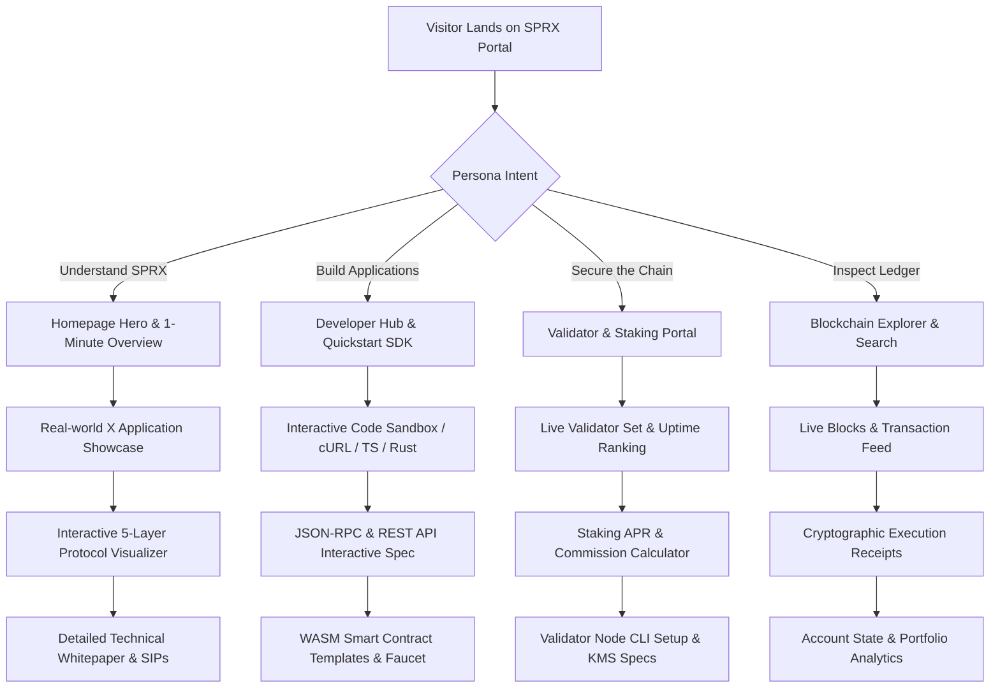

# SPRX Protocol: Information Architecture (IA) Specification
**Document Version:** 1.0.0-IA  
**Date:** 2026-08-21  
**Target:** SPRX (Scalable Protocol for Real-world X) Ecosystem Platform

---

## 1. Information Architecture Philosophy & Strategy

The SPRX information architecture is built to solve the multi-persona challenge of Layer-1 blockchain protocols: serving **novice users**, **smart contract engineers**, **enterprise architects**, **validator operators**, **token delegators**, and **protocol researchers** from a single unified portal without friction or cognitive dissonance.

### Core Architectural Principles:
1. **Tiered Progressive Disclosure**: Surface high-level utility, intuitive visual representations, and key metrics first; provide immediate one-click pathways into deep cryptographic and implementation specifications.
2. **Omnichannel Unified Navigation**: Clean, uncluttered global header with structured mega-menus, responsive mobile drawer, and instant global command palette (`Ctrl+K` / `Cmd+K`).
3. **Multi-Currency & Network-Aware**: Persistent global state allowing users to seamlessly switch between Mainnet, Testnet, and Local Devnet, as well as toggle fiat presentation currencies (USD, INR, EUR, GBP, JPY).
4. **Contextual Cross-Linking**: Documentation, developer guides, explorer pages, and ecosystem apps form an interconnected graph rather than siloed sub-domains.

---

## 2. Global Navigation & Mega-Menu Topology

```
+-------------------------------------------------------------------------------------------------------------------------+
| [LOGO] SPRX    Explore ▾    Learn ▾    Developers ▾    Network ▾    Ecosystem ▾    Community ▾    Research ▾            |
|                                                                     [Search ⌘K]  [Testnet ▾]  [USD $ ▾]  [☀️/🌙] [Get Started]|
+-------------------------------------------------------------------------------------------------------------------------+
```

### 2.1 Primary Navigation Mega-Menu Breakdown

#### 1. Explore ▾
- **Blockchain Explorer**: Live block stream, transaction inspector, address portfolio, and gas tracker (`/explorer`).
- **Blocks & Finality**: Verified blocks, proposer attribution, and state root commitments (`/explorer/blocks`).
- **Transactions**: Atomic transaction ledger with decoding for transfer, delegation, and contract messages (`/explorer/transactions`).
- **Verified Smart Contracts**: WASM contract bytecode, CW20 tokens, and on-chain escrow registries (`/explorer/contracts`).
- **Network Analytics**: TPS dynamics, gas utilization, block latency, and decentralization coefficients (`/explorer/analytics`).

#### 2. Learn ▾
- **What is SPRX?**: High-level introduction to the Scalable Protocol for Real-world X (`/learn/what-is-sprx`).
- **Real-world X Verticals**: Deep-dive into Payments, RWA, Identity, Commerce, and DePIN rails (`/learn/real-world-x`).
- **SPRX Tokenomics**: 1B native supply, 18 decimals, EIP-1559 base burn, and staking yield economics (`/learn/tokenomics`).
- **Consensus & Security**: Byzantine Fault Tolerance (BFT-PoS), 1.5s finality, and slashing defense (`/learn/consensus`).
- **Wallets & Self-Custody**: Beginner guides to seed phrases, hardware keys, and safe transaction signing (`/learn/wallets`).
- **Security Best Practices**: Scam mitigation, phishing prevention, and contract safety checks (`/learn/security`).

#### 3. Developers ▾
- **Developer Hub**: Quickstart pathways, SDKs, CLI tools, and architecture maps (`/developers`).
- **Interactive Documentation**: Nested technical docs, code playgrounds, and API references (`/developers/docs`).
- **JSON-RPC & REST Reference**: Complete endpoint specs for `sprax_getStatus`, `sprax_broadcastTx`, and indexer APIs (`/developers/rpc`).
- **Smart Contract Development**: Building and deploying Rust CosmWasm WASM contracts (`/developers/smart-contracts`).
- **Client SDKs**: TypeScript `@sprax/wallet-core`, Rust crates, and Go/Python connectors (`/developers/sdk`).
- **Run a Node**: Node hardware specs, CLI initialization, sync catchup, and RPC configuration (`/developers/nodes`).
- **Protocol Standards (SXS)**: SXS-20 fungible tokens, SXS-721 real-world assets, and escrow interfaces (`/developers/standards`).
- **Testnet Faucet**: Request rate-limited `tSPRX` tokens for smart contract testing (`/developers/faucet`).

#### 4. Network ▾
- **Network Overview**: High-level topology, parameter registry, and active chain metrics (`/network`).
- **Validators & Leaderboard**: Ranked validator set, voting power, commission, uptime, and slashes (`/network/validators`).
- **Staking & Delegation**: Staking reward calculator, unbonding periods, and delegation management (`/network/staking`).
- **Protocol Parameters**: Block size, minimum gas price, governance thresholds, and slashing percentages (`/network/parameters`).
- **Network Status & Health**: Real-time peer connectivity, consensus round states, and mempool depth (`/network/status`).
- **Network Upgrades**: State migration schedule, upgrade coordinate tracking, and changelogs (`/network/upgrades`).

#### 5. Ecosystem ▾
- **Ecosystem Directory**: Filterable directory of dApps across DeFi, RWA, Payments, Infrastructure, and Tools (`/ecosystem`).
- **Discover**: Curated showcase of trending apps, new deployments, and high-impact protocols (`/discover`).
- **Markets & Price Feeds**: Live asset tickers, multi-timeframe interactive charts, and volume rankings (`/markets`).
- **Submit a Project**: Developer verification and listing onboarding portal (`/ecosystem/submit`).

#### 6. Community & Governance ▾
- **Community Hub**: Global builder hubs, developer ambassadors, and contributor programs (`/community`).
- **On-Chain Governance**: Active voting proposals, deposit period queues, and voting power tallies (`/governance`).
- **SPRX Improvement Proposals (SIPs)**: Protocol proposal repository across Core, Standards, and Meta (`/sips`).
- **Ecosystem Grants**: Funding programs for open-source tools, infrastructure, and real-world dApps (`/community/grants`).
- **Events & Hackathons**: Upcoming protocol workshops, dev sessions, and global conferences (`/community/events`).
- **Bug Bounty Program**: Responsible disclosure guidelines, vulnerability tiers, and rewards (`/security/bug-bounty`).

#### 7. Research ▾
- **Research Hub**: Cryptographic proofs, consensus mechanics, and scalability papers (`/research`).
- **Consensus & BFT-PoS**: Mathematical analysis of safety, liveness, and dynamic validator sets (`/research/consensus`).
- **Account Abstraction & RWA**: Native multi-currency gas payment and real-world asset verification models (`/research/rwa`).
- **State Storage & Pruning**: Redb and Jellyfish Merkle Tree zero-knowledge proofs (`/research/storage`).

---

## 3. Global Utility Controls Specification

| Control | Position | Functionality & State |
| :--- | :--- | :--- |
| **Command Search (`⌘K`)** | Top-Right Header | Modal search with auto-classification: Address (`sprax1...` / `0x...`), Tx Hash (`0x...`), Block Height (`#1234`), Validator, Token, Doc Page, or Ecosystem App. |
| **Network Selector** | Top-Right Header | Dropdown with active status badge: `SPRX Mainnet` (Production Ready), `SPRX Testnet 1` (`sprax-testnet-1`), `Local Devnet` (`127.0.0.1:26657`). |
| **Fiat Currency Selector** | Top-Right Header | Switches presentation conversions across `USD ($)`, `INR (₹)`, `EUR (€)`, `GBP (£)`, `JPY (¥)`. |
| **Theme Toggle** | Top-Right Header | Instant smooth toggle between Obsidian Dark Mode (default) and High-Contrast Light Mode. |
| **Primary Action Button** | Top-Right Header | Adaptive CTA: "Explore SPRX" on home / "Connect Wallet" on interactive tools / "Get Started" for beginners. |

---

## 4. Content Progressive Disclosure Matrix



---

## 5. Breadcrumb & URL Routing Hierarchy

To ensure deterministic navigation and optimal SEO indexing, every page follows a structured URL schema:

```
/ (Homepage)
├── /about
├── /whitepaper
├── /brand
├── /learn/
│   ├── what-is-sprx
│   ├── real-world-x
│   ├── tokenomics
│   ├── consensus
│   ├── wallets
│   └── security
├── /developers/
│   ├── docs/ (nested documentation)
│   ├── rpc
│   ├── sdk
│   ├── smart-contracts
│   ├── nodes
│   ├── standards
│   └── faucet
├── /network/
│   ├── validators
│   ├── validator/:id
│   ├── staking
│   ├── parameters
│   ├── status
│   └── upgrades
├── /explorer/
│   ├── blocks
│   ├── block/:id
│   ├── transactions
│   ├── tx/:hash
│   ├── address/:addr
│   ├── contracts
│   ├── contract/:addr
│   └── analytics
├── /ecosystem/
│   ├── discover
│   ├── markets
│   └── submit
├── /governance/
│   ├── sips
│   ├── sip/:id
│   └── proposals
├── /community/
│   ├── grants
│   └── events
├── /research/
│   ├── consensus
│   └── rwa
└── /security/
    └── bug-bounty
```
