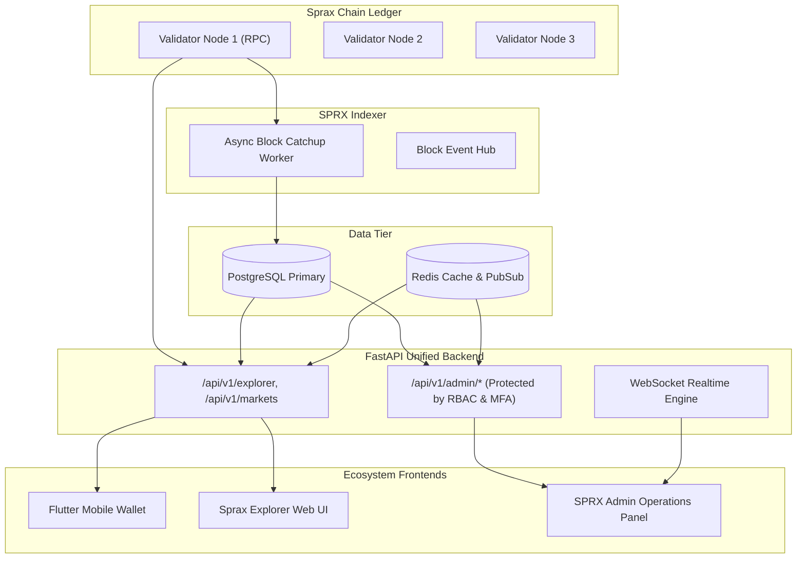

# SPRX Ecosystem: Centralized Admin Operations Architecture
**Document Version:** 1.0.0  
**Target:** Infrastructure, SRE, Ops, Security

---

## 1. Unified Architecture Topology

---

## 2. Invariants & Isolation
1. **Zero Browser Direct Connections**: Browser frontends NEVER connect directly to PostgreSQL, Redis, or raw Tendermint node admin RPC ports.
2. **Single Source of Truth**: Admin Panel queries the unified backend which reflects PostgreSQL indexer tables and RPC node state.
3. **Strict Non-Custodial Isolation**: No private keys or wallet mnemonics are accessible or stored on backend databases.
