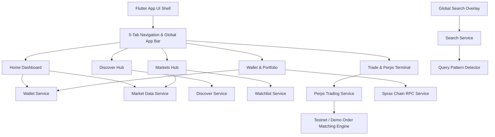

# SPRX Mobile Wallet — Advanced Upgrade Status

## Overview
SPRX (Scalable Protocol for Real-world X) Mobile Wallet upgrade roadmap from a basic wallet utility into a tier-1 crypto-fintech application featuring **Discover**, **Markets**, **Perpetuals (Futures)**, **Global Search**, and an upgraded **Portfolio & Design System**.

---

## 1. Upgrade Matrix & Component Status

| Major System | UI Status | Data / Service Layer | Testnet Execution | Mainnet Production Readiness | Status |
| :--- | :--- | :--- | :--- | :--- | :--- |
| **Global Navigation** | Complete (5 Tabs + Global Bar) | Connected to State Providers | N/A | Production Ready | **COMPLETE** |
| **Global Search** | Complete (Auto-detect + Grouped) | Debounced Multi-entity Indexer | Connected | Production Ready | **COMPLETE** |
| **Markets Hub** | Complete (Tabs, Movers, Stats) | Real-time Market Data Service | Connected | Production Ready | **COMPLETE** |
| **Asset Details & Charts** | Complete (Line/Candle + Crosshair) | Historical OHLCV + Tickers | Connected | Production Ready | **COMPLETE** |
| **Watchlist** | Complete (Persistence + Quick Ticker) | SharedPreferences / Secure Store | Connected | Production Ready | **COMPLETE** |
| **Discover Hub** | Complete (Ecosystem, Movers, Guides) | Curated & RPC Ecosystem Metadata | Connected | Production Ready | **COMPLETE** |
| **Perps Interface** | Complete (Mobile-first terminal) | Orderbook + Funding + Positions | Testnet / Demo Engine | **BLOCKED** (Requires formal audited settlement contract) | **TESTNET ONLY** |
| **Unified Trade Hub** | Complete (Perps + Swap routing) | Dynamic pair & mode selector | Connected | Production Ready | **COMPLETE** |
| **Portfolio & Staking** | Complete (Separated Balances) | RPC + Staking Delegation | Connected | Production Ready | **COMPLETE** |
| **Notifications** | Complete (Price alerts, fills, txs) | In-app Event Notification Bus | Connected | Production Ready | **COMPLETE** |

---

## 2. Architecture & Data Flow

---

## 3. Production Security & Safety Controls
- **Non-Custodial Rule**: Seed phrases, mnemonic words, and private keys never leave local hardware-backed storage (`flutter_secure_storage`).
- **Perps Mainnet Guard**: Real-money Perpetual Futures are strictly gated behind an explicit `TESTNET / DEMO MODE` banner until on-chain perpetual futures contracts and oracle feeds are verified and audited.
- **Isolated Balances**: On-chain wallet balance is strictly separated from staked funds and active trading margin collateral.

---

## 4. Documentation Index
- `docs/DISCOVER_STATUS.md` — Detailed Discover system architecture and data sources.
- `docs/MARKETS_STATUS.md` — Markets data pipeline, chart specifications, and tickers.
- `docs/PERPS_STATUS.md` — Perpetual futures UI architecture, testnet risk management, and order engine.
- `docs/SEARCH_STATUS.md` — Global search pattern detection, multi-entity indexing, and routing.
