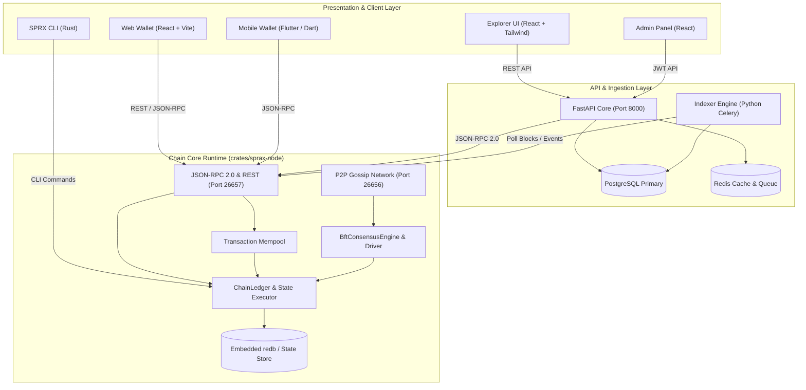

# SPRX Protocol — Master System Architecture

## System Pillars

1. **Modular Crate Separation**: Clear boundaries between types, crypto, storage, consensus, ledger execution, and network transport.
2. **Deterministic BFT-PoS Consensus**: 2-step Prevote & Precommit voting with Deterministic Weighted Round Robin (DWRR) proposer election.
3. **Dual Cryptographic Suite**: Ed25519 for validators & high-speed accounts; Secp256k1 for hardware wallets and cross-chain bridging.
4. **Decoupled Client & Presentation Layer**: Wallets sign transactions offline; backend and RPC nodes never receive private keys.
5. **Real-time Fiat Abstraction**: Native balances are strictly maintained in 18-decimal atto-SPRX, with decoupled client-side currency valuation (USD, INR, EUR, JPY).
