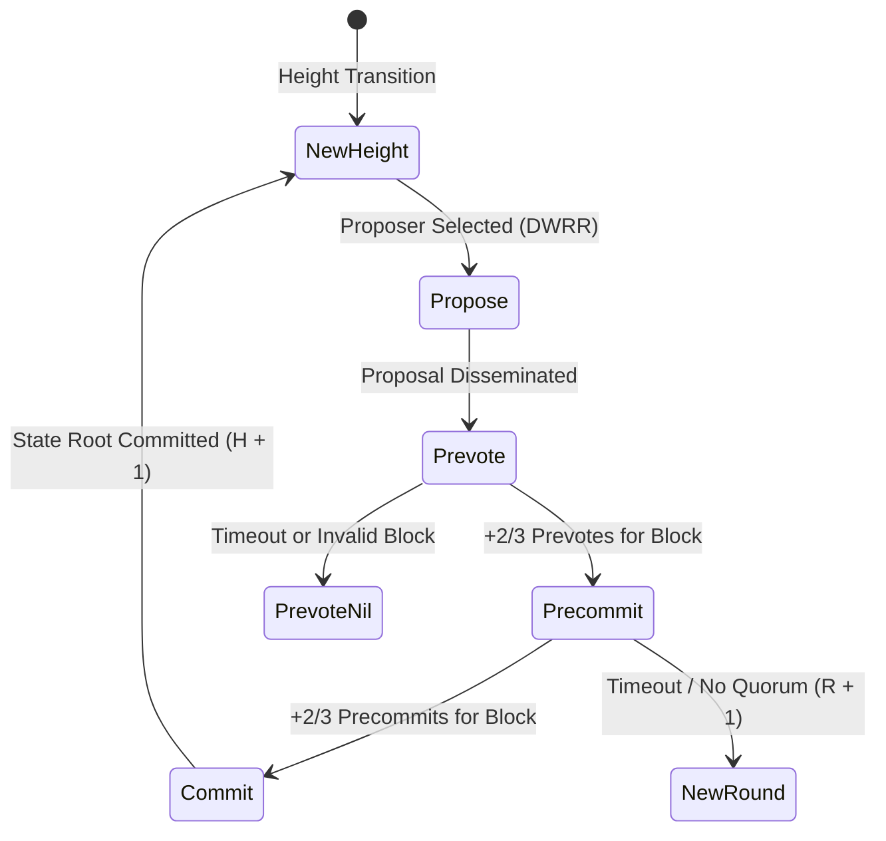

# SPRX Protocol: Consensus Implementation Specification
**Document Version:** 1.0.0  
**Target:** Core Protocol, Consensus State Machine, Byzantine Quorum Rules

---

## 1. Overview & Framework Fidelity

The **SPRX Protocol** implements the standard **CometBFT (formerly Tendermint) BFT-PoS** consensus algorithm. In strict accordance with protocol architectural principles, **SPRX does not use an unproven or proprietary consensus algorithm**. 

The consensus engine provides **instant, single-block deterministic finality** with zero probabilistic chain reorganization under the partial synchrony model.

---

## 2. Mathematical Formalization

### 2.1 Quorum Threshold
Let $W = \sum_{i=1}^{n} w_i$ be the total active voting power of the validator set $\mathcal{V} = \{v_1, v_2, \dots, v_n\}$.

The consensus quorum threshold $Q$ required to complete Prevote or Precommit phases is defined as:
$$Q = \left\lfloor \frac{2W}{3} \right\rfloor + 1$$

A vote aggregation $S \subseteq \mathcal{V}$ satisfies quorum if and only if:
$$\sum_{v_j \in S} w_j \ge Q$$

### 2.2 Byzantine Fault Tolerance Limit
The network guarantees safety and liveness provided that the total Byzantine (faulty or malicious) voting power $B$ satisfies:
$$B < \frac{W}{3}$$

If $B \ge \frac{W}{3}$, the protocol prioritizes **Safety over Liveness**: consensus halts and prevents conflicting blocks from being finalized, awaiting governance or manual intervention.

---

## 3. Consensus State Machine & Round Steps

A consensus instance operates on height $H \in \mathbb{N}$ through discrete rounds $R \in \{0, 1, 2, \dots\}$ consisting of 5 distinct steps:

### 3.1 Step 1: NewHeight
- Round counter is reset to $R = 0$.
- Previous height's state transitions are committed to the key-value store.
- Active validator set $\mathcal{V}_H$ and total power $W_H$ are established.

### 3.2 Step 2: Propose
- The proposer $P(H, R) \in \mathcal{V}$ is selected deterministically using the **Deterministic Weighted Round-Robin (DWRR)** priority accumulation algorithm.
- Proposer bundles pending mempool transactions, executes staging state transitions, computes `state_root`, and broadcasts a `BlockProposal(H, R, Block)`.

### 3.3 Step 3: Prevote
- Each validator verifies the proposal's header validity, parent hash link, and transaction validity.
- If valid, the validator casts $\text{Prevote}(H, R, \text{BlockHash})$.
- If invalid or timeout expires ($\text{timeout\_prevote} = 500\text{ms}$), the validator casts $\text{Prevote}(H, R, \text{Nil})$.
- When a validator observes $\ge Q$ prevotes for $\text{BlockHash}$, it locks on $(\text{BlockHash}, R)$ and unlocks any previous lock.

### 3.4 Step 4: Precommit
- If validator observed $\ge Q$ prevotes for $\text{BlockHash}$, it casts $\text{Precommit}(H, R, \text{BlockHash})$.
- Otherwise, it casts $\text{Precommit}(H, R, \text{Nil})$.
- If $\ge Q$ precommits for $\text{BlockHash}$ are received, the block is finalized.

### 3.5 Step 5: Commit
- Active validators aggregate commit signatures $\mathcal{C} = \{\sigma_1, \dots, \sigma_k\}$ into the block header.
- State root is committed to disk.
- Engine transitions to Height $H + 1$.

---

## 4. Deterministic Weighted Round-Robin (DWRR) Proposer Selection

To ensure fair and predictable proposer selection proportional to stake without randomness manipulation:

1. In each round $R$, each validator's priority increments by its voting power:
   $$p_i \leftarrow p_i + w_i$$
2. The proposer selected is:
   $$P^* = \arg\max_{v_i \in \mathcal{V}} (p_i)$$
   *(Ties broken deterministically by lexicographical order of validator address).*
3. The selected proposer's priority is decremented by the total voting power:
   $$p_{P^*} \leftarrow p_{P^*} - W$$

---

## 5. Security & Safety Invariants

1. **No Forking Under $B < W/3$**: No two honest validators will ever commit different blocks at the same height.
2. **Deterministic State Transition**: Block verification produces identical Merkle `state_root` across all nodes.
3. **Replay Protection**: Nonces increment strictly monotonically per account.
4. **Signature Verifiability**: Commit signatures are preserved on-chain enabling light client verification.
