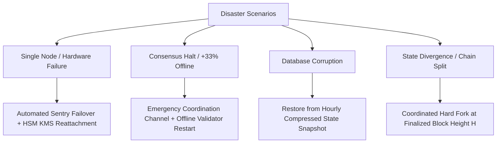

# SPRX Protocol: Disaster Recovery & Business Continuity Plan
**Document Version:** 1.0.0  
**Target:** Infrastructure Team, Validator Coordinators, Emergency Responders

---

## 1. Disaster Scenarios & Recovery Procedures



### 1.1 Scenario 1: Validator Hardware Crash
- **RTO (Recovery Time Objective)**: $< 15\text{ minutes}$
- **RPO (Recovery Point Objective)**: $0\text{ blocks}$ (No double-signing!)
- **Procedure**:
  1. Terminate crashed compute instance completely to prevent double signing.
  2. Boot standby node from latest hourly state snapshot.
  3. Reattach remote HSM signing endpoint.
  4. Perform P2P catch-up sync before unjailing.

### 1.2 Scenario 2: Network Consensus Halt ($> 33\%$ Offline)
- **Procedure**:
  1. Detect consensus halt via Prometheus alert (`rate(sprax_block_height[2m]) == 0`).
  2. Convene emergency validator operational bridge.
  3. Identify root cause (e.g. cloud provider regional outage).
  4. Spin up replacement validators in alternative cloud zones / bare metal.
  5. Resume round progression once $+2/3$ quorum is restored.

### 1.3 Scenario 3: Corrupted Local State Store
- **Procedure**:
  1. Stop node daemon: `kill -TERM $(pgrep sprax)`.
  2. Download verified state snapshot from archive cluster:
     ```bash
     sprax snapshot download --chain-id sprax-mainnet-1 --snapshot-height latest
     ```
  3. Verify Blake3 state root against network header consensus.
  4. Restart node and resume live block ingestion.
