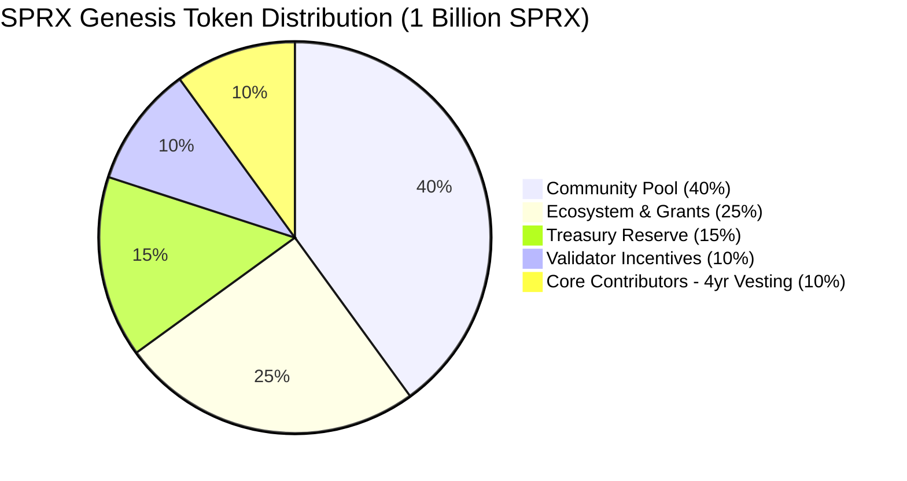

# SPRX Protocol: Mainnet Genesis Specification
**Document Version:** 1.0.0  
**Chain ID:** `sprax-mainnet-1`  
**Total Initial Supply:** $1,000,000,000\text{ SPRX}$ ($10^{27}\text{ atto-SPRX}$)  

---

## 1. Genesis Allocation Schedule



| Allocation Pool | Amount (SPRX) | Amount (atto-SPRX) | % of Genesis | Vesting / Lockup Terms |
| :--- | :--- | :--- | :--- | :--- |
| **Community Pool** | $400,000,000$ | $4 \times 10^{26}$ | $40.0\%$ | Governed via On-Chain Proposals |
| **Ecosystem & Grants**| $250,000,000$ | $2.5 \times 10^{26}$| $25.0\%$ | 2-year linear grant disbursement |
| **Treasury Reserve** | $150,000,000$ | $1.5 \times 10^{26}$| $15.0\%$ | Multi-sig operational treasury |
| **Validator Incentives**| $100,000,000$ | $1 \times 10^{26}$ | $10.0\%$ | Genesis staking incentives |
| **Core Contributors**| $100,000,000$ | $1 \times 10^{26}$ | $10.0\%$ | 1-year cliff + 4-year linear vesting |
| **TOTAL INITIAL SUPPLY**| **1,000,000,000** | **$10^{27}$** | **100.0%** | **Supply Conserved** |

---

## 2. Consensus & Execution Parameters

```json
{
  "chainId": "sprax-mainnet-1",
  "genesisTimeUnixSecs": 1735689600,
  "initialHeight": 0,
  "consensusParams": {
    "blockTimeTargetMs": 1500,
    "maxBlockGas": 20000000,
    "maxBlockSizeBytes": 4194304,
    "minGasPriceAtto": 1000000000
  },
  "stakingParams": {
    "unbondingPeriodBlocks": 1209600,
    "maxValidators": 100,
    "minSelfDelegationAtto": 1000000000000000000000,
    "equivocationSlashRate": 0.05,
    "downtimeSlashRate": 0.0001,
    "signedBlocksWindow": 10000,
    "minSignedPerWindow": 0.50
  }
}
```
