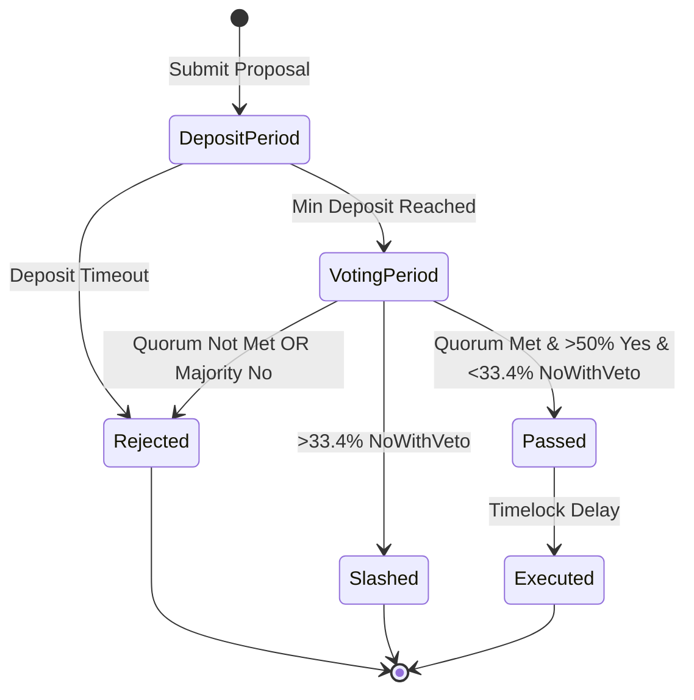

# SPRX Protocol — On-Chain Governance Specification

## Governance Overview
SPRX Protocol incorporates an on-chain governance state machine enabling token holders and validators to propose, debate, and vote on parameter changes, community pool disbursements, and network upgrades.

---

## Proposal Lifecycle

---

## Governance Parameters

| Parameter | Value | Description |
|:---|:---|:---|
| **Min Initial Deposit** | 1,000 SPRX | Minimum deposit to create a proposal |
| **Max Deposit Period** | 14 Days | Time window to reach full deposit |
| **Voting Period** | 7 Days | Duration of active on-chain voting |
| **Quorum Threshold** | 33.4% | Minimum percentage of staked tokens required to vote |
| **Pass Threshold** | 50.0% | Simple majority of non-abstaining votes |
| **Veto Threshold** | 33.4% | Percentage of `NoWithVeto` votes required to reject and burn deposit |
