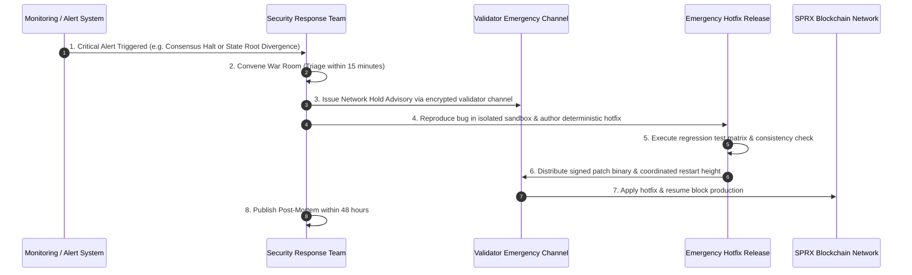

# SPRX Protocol: Security Incident Response Plan (IRP)
**Document Version:** 1.0.0  
**Target:** Core Contributors, Validator Operators, Security Response Team

---

## 1. Incident Severity Levels

```
+-------------------------------------------------------------------------+
| SEV-1 (CRITICAL)   : Consensus Halt, Fund Drainage, Chain Reorganization|
| SEV-2 (HIGH)       : State Divergence, Validator Mass Jailing           |
| SEV-3 (MEDIUM)     : RPC Degradation, Faucet Flooding, Indexer Lag      |
| SEV-4 (LOW)        : Minor CLI bugs, non-critical telemetry failures    |
+-------------------------------------------------------------------------+
```

---

## 2. Emergency Response Protocol



---

## 3. Validator Emergency Key Compromise Procedure

If a validator operator suspects consensus private key compromise:
1. **Immediate Unstaking / Jailing**: Submit self-jailing or unbonding transaction from operator key.
2. **Key Rotation**: Generate new Ed25519 consensus keypair on an air-gapped machine.
3. **State Migration**: Submit on-chain validator key update message signed by operator address.
4. **Post-Mortem**: Document root cause (e.g. compromised server, exposed secrets).
