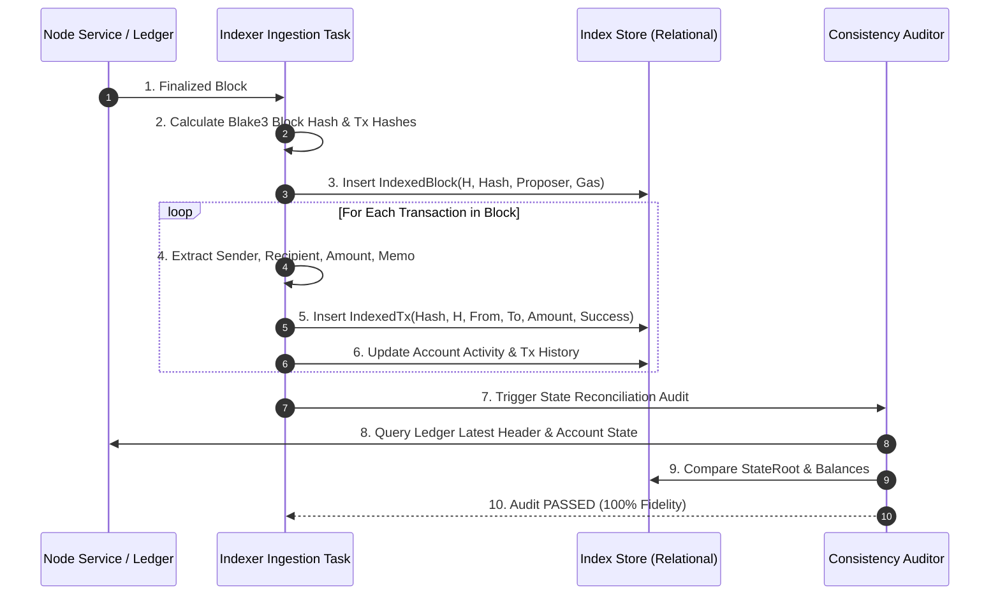

# SPRX Protocol: Indexer Ingestion & Data Pipeline
**Document Version:** 1.0.0  
**Target:** Event Processing, Storage Optimization, State Reconciliation

---

## 1. Indexing Workflow

---

## 2. Ingestion Stages & Transforms

### Stage 1: Header Ingestion & Hash Validation
- Header metadata (`height`, `parent_hash`, `timestamp_unix_secs`, `proposer`, `state_root`, `txs_root`) is validated against cryptographic commitments.
- Total gas consumed is aggregated across all execution receipts.

### Stage 2: Transaction Normalization & Event Splitting
- Each `Transaction` in `BlockBody` is unpacked:
  - `TxMessage::Transfer { to, amount }` extracts transfer value and recipient.
  - Senders and recipients are indexed into bidirectional lookup arrays for instant address timeline generation.

### Stage 3: Validator & Staking Tracking
- Synchronizes with `StakingKeeper`:
  - Computes relative voting power share: $\text{Share}_i = \frac{w_i}{W_{\text{total}}} \times 100\%$.
  - Tracks uptime percentages and slashing history.

### Stage 4: State Consistency Audits
- Periodically verifies that:
  $$\text{Indexer}.\text{height} = \text{Ledger}.\text{height}$$
  $$\text{Indexer}.\text{state\_root} = \text{Ledger}.\text{state\_root}$$
  $$\sum_{\text{Indexed Accounts}} \text{balance}_i = \text{Ledger Total Supply}$$
