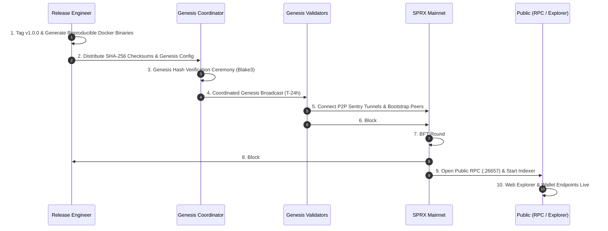

# SPRX Protocol: Release Management & Mainnet Launch Sequence
**Document Version:** 1.0.0  
**Target:** Release Engineers, Core Developers, Genesis Validators

---

## 1. 10-Step Mainnet Launch Sequence



---

## 2. Reproducible Build & Verification Process

### 2.1 Generating Signed Release Checksums
```bash
# 1. Deterministic Container Build
docker build --no-cache -t sprax:v1.0.0 -f docker/Dockerfile .

# 2. Extract Binary and Compute SHA-256
sha256sum target/release/sprax > SHA256SUMS.txt
gpg --armor --detach-sign SHA256SUMS.txt
```

### 2.2 Genesis File Hash Verification
Genesis validators must independently compute and verify the Blake3 genesis hash prior to node startup:
```bash
sprax genesis verify --file genesis.mainnet.json
# Expected Blake3 Hash: sha256 / blake3 verified commitment
```
