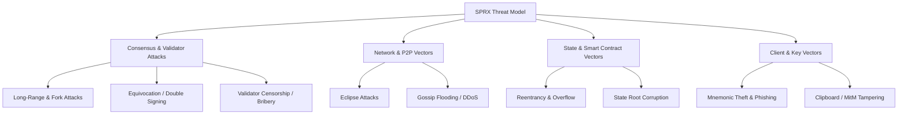

# SPRX Protocol: Comprehensive Threat Model
**Document Version:** 1.0.0  
**Methodology:** STRIDE + Blockchain Attack Vector Classification

---

## 1. Threat Classification Matrix

---

## 2. Threat Analysis & Defensive Invariants

### 2.1 Consensus & Validator Level Attacks
| Threat Vector | Attack Mechanism | Impact | Architectural Mitigation |
| :--- | :--- | :--- | :--- |
| **Double Spending / 51% Attack** | Attacker signs two conflicting block proposals at height $H$ | Chain split / Reversal | CometBFT requires $+2/3$ precommit quorum; equivocation evidence results in immediate 5% slash + permanent tombstone. |
| **Nothing-at-Stake** | Validators voting on multiple conflicting forks | Consensus instability | Slashing rules punish voting on multiple blocks at the same height/round. |
| **Proposer Grind / Censorship** | Colluding validator manipulating proposer selection | Transaction censorship | Deterministic Weighted Round-Robin (DWRR) dynamically computes priority offsets; no validator can game entropy. |
| **Long-Range Attack** | Compromised historic keys creating alternate chain history | Subjective fork | Unbonding period (21 days) + Weak Subjectivity checkpoints. |

### 2.2 Network & P2P Layer Attacks
| Threat Vector | Attack Mechanism | Impact | Architectural Mitigation |
| :--- | :--- | :--- | :--- |
| **Eclipse Attack** | Attacker monopolizes all inbound/outbound P2P peer connections | Node isolation | Multi-seed bootstrap discovery, connection rotation, IP address diversity limits. |
| **P2P Gossip Flood (DDoS)** | Flooding network with invalid transactions or blocks | Node exhaustion | Length-prefixed framing (10 MB max), stateless pre-filtering before gossip propagation. |
| **Sybil Attack** | Spawning millions of peer identities | Resource exhaustion | Staking-weighted validator network + peer connection limits per IP CIDR subnet. |

### 2.3 State Machine & Smart Contract Exploits
| Threat Vector | Attack Mechanism | Impact | Architectural Mitigation |
| :--- | :--- | :--- | :--- |
| **Reentrancy Attack** | Calling back into calling contract before state update | Fund drainage | Runtime call stack tracking (`enter_call` lock) + Checks-Effects-Interactions (CEI). |
| **Integer Overflow/Underflow**| Wraparound in arithmetic operations | Unauthorized minting | Rust checked math (`checked_add`, `checked_sub`) returning explicit error types. |
| **State Root Desynchronization**| Divergent execution results across nodes | Consensus fork | Canonical deterministic state serialization (sorted KV prefixes) + Blake3 state root commitments. |

### 2.4 Client & Wallet Attacks
| Threat Vector | Attack Mechanism | Impact | Architectural Mitigation |
| :--- | :--- | :--- | :--- |
| **MitM Transaction Alteration**| Proxy altering recipient address | Fund diversion | Offline transaction signing; node asserts signature matches canonical `TxBody`. |
| **Storage Extraction** | Stealing keystore files from device | Private key theft | AES-256-GCM encryption with PBKDF2 (100,000 rounds) + hardware-backed Android Keystore. |
| **Clipboard Hijacking** | Replacing copied address with attacker's | Incorrect recipient | Bech32 checksum validation detects corrupted or substituted characters. |
