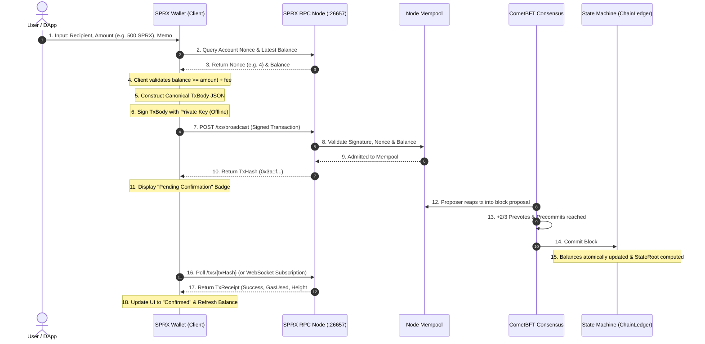

# SPRX Protocol: End-to-End Transaction Flow
**Document Version:** 1.0.0  
**Target:** Client-to-Chain Transaction Pipeline, Signature Verification, Finality

---

## 1. Transaction Lifecycle Diagram

---

## 2. Step-by-Step Execution Breakdown

### Step 1: Client Transaction Construction
- The user enters a recipient address (`sprax1...` or `0x...`) and amount in SPRX.
- `TransactionBuilder.sprxToAtto` converts decimal SPRX to atomic `atto-SPRX` ($10^{18}$).
- Default network fee ($0.0005\text{ SPRX}$, gas limit $200,000$) is attached.

### Step 2: Nonce Fetching & Offline Signing
- The wallet fetches the sender's current nonce $N$ via JSON-RPC.
- The wallet constructs canonical JSON `TxBody` without whitespace variations.
- The client generates an Ed25519 signature $\sigma = \text{Sign}_{sk}(\text{sign\_bytes})$ entirely in local memory.

### Step 3: Broadcast & Mempool Admission
- The wallet submits `{ body, keyType: "Ed25519", publicKey, signature }` to the node via `POST /txs/broadcast`.
- The node executes stateless checks:
  1. Validates signature $\sigma$ against `publicKey`.
  2. Asserts `sender` equals $\text{Address}(\text{publicKey})$.
  3. Checks that account balance $\ge \text{amount} + \text{fee}$.
  4. Checks that nonce equals current account nonce $N$.
- The transaction enters the node mempool and is gossiped to connected P2P peers.

### Step 4: Block Inclusion & State Execution
- The elected block proposer bundles the transaction into block $H$.
- `TxExecutor` executes the state transition:
  - Decrements sender balance by $\text{amount} + \text{fee}$.
  - Increments recipient balance by $\text{amount}$.
  - Increments sender nonce $N \leftarrow N + 1$.
  - Generates `TxReceipt`.
- CometBFT reaches +2/3 precommit consensus quorum, committing the block with 1-block deterministic finality.

### Step 5: Client Confirmation & Receipt Display
- The wallet receives the execution receipt containing block height, gas used, and final status (`SUCCESS`).
- The wallet updates the local transaction feed and emits a confirmation notification.
