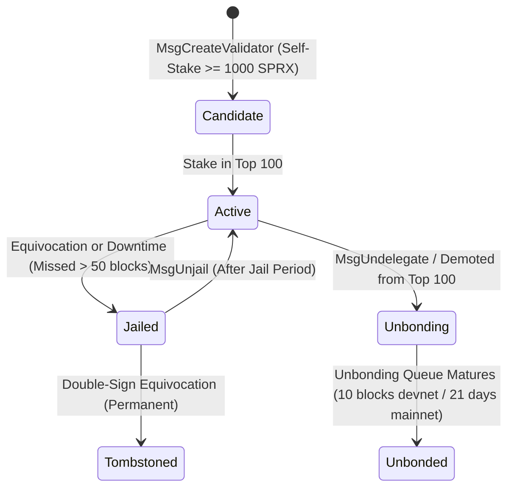

# SPRX Protocol: Validator & Delegation Architecture
**Document Version:** 1.0.0  
**Target:** Validator Operations, Staking Economics, Delegation Lifecycle

---

## 1. Validator Overview

Validators are nodes responsible for securing the SPRX network by participating in CometBFT consensus, proposing new blocks, and verifying state transitions.

---

## 2. Validator Identity & Parameters

Each validator possesses distinct on-chain metadata:

| Field | Type | Description |
| :--- | :--- | :--- |
| `operator_address` | `Address` (Bech32 `spraxvaloper1...`) | Operator account address controlling staking actions |
| `consensus_pubkey` | `Ed25519` / `Secp256k1` (32 bytes) | Cryptographic key used exclusively for block signing |
| `moniker` | `String` (1–64 chars) | Human-readable validator display name |
| `identity` | `String` (optional) | 16-digit Keybase / PGP verification identity |
| `website` | `String` (optional) | Official validator URL |
| `details` | `String` (optional) | Description of infrastructure and security profile |
| `commission.rate` | `f64` (0.00 to 0.20) | Current commission percentage on delegator rewards (e.g. 5%) |
| `commission.max_rate` | `f64` (up to 0.20) | Maximum lifetime commission rate (e.g. 20%) |
| `commission.max_change` | `f64` (e.g. 0.01/day) | Maximum daily commission adjustment |

---

## 3. Validator Lifecycle State Machine

### 3.1 Lifecycle States:
- **`Candidate`**: Registered with minimum self-stake ($\ge 1,000\text{ SPRX}$), awaiting sufficient delegation to enter the active set.
- **`Active`**: Among the top 100 validators by bonded stake. Actively votes in consensus and earns block rewards.
- **`Jailed`**: Suspended from consensus due to downtime or equivocation. Earns zero block rewards.
- **`Unbonding`**: Tokens transitioning out of bonded state; subject to slashing if past infractions occurred.
- **`Unbonded`**: Tokens returned to liquid account balance.
- **`Tombstoned`**: Permanently barred from consensus following verified double-signing.

---

## 4. Delegation & Token Mechanics

### 4.1 Token Bonding & Voting Power
- **1 SPRX Staked = 1 Unit of Voting Power**: Voting power is calculated dynamically as $\lfloor \text{Bonded Stake in atto-SPRX} / 10^{18} \rfloor$.
- **Fractional Shares**: Delegator deposits are accounted for as proportional shares in the validator pool, adjusting automatically when slashing occurs.

### 4.2 Unbonding Period
- **Development Testnet**: 10 blocks.
- **Production Mainnet**: 21 days ($201,600\text{ blocks}$ at $1.5\text{s}$ block time).
- **Purpose**: Protects against long-range attacks and ensures that unbonding delegators remain subject to slashing for past Byzantine acts.

---

## 5. Reward Distribution Model

For each finalized block at height $H$:
1. **Base Block Inflation Reward** + **Transaction Fees** are aggregated into the block reward pool $\mathcal{R}_H$.
2. The active block proposer receives a **5% Proposer Bonus**.
3. The remaining 95% is distributed proportionally to all active validators based on their voting power:
   $$\mathcal{R}_i = 0.95 \times \mathcal{R}_H \times \frac{w_i}{W}$$
4. For each validator $v_i$, the validator takes its commission:
   $$\mathcal{C}_i = \mathcal{R}_i \times c_i$$
5. The remainder $(\mathcal{R}_i - \mathcal{C}_i)$ is distributed to delegators proportional to their pool shares.

---

## 6. Validator Key Security & Best Practices

1. **Key Separation**:
   - **Consensus Key**: Placed in HSM / Tendermint KMS. Never stored on hot web servers.
   - **Operator Key**: Used for signing staking and governance transactions.
   - **Reward Withdrawal Key**: Isolated offline cold storage address.
2. **Double-Sign Defense**:
   - Software double-signing protection table tracking `(height, round, vote_type)`.
   - Tendermint KMS with hardware enclave validation (YubiHSM2 / AWS CloudHSM).
