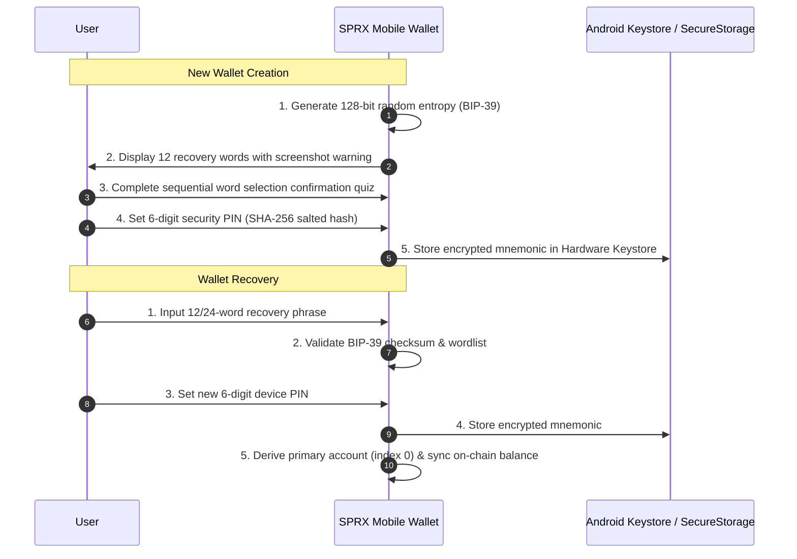

# SPRX Protocol: Wallet Backup & Recovery Specification
**Document Version:** 1.0.0  
**Target:** Client Security, Key Derivation, Recovery Flow

---

## 1. Mnemonic Standard & Derivation Parameters
- **Mnemonic Standard**: BIP-39 (12-word recovery phrase with 128 bits of cryptographic entropy).
- **HD Derivation Path**: BIP-44 path `m/44'/9999'/0'/0/i`.
- **Address Encoding**: Bech32 `sprax1...` with 20-byte payload derived via `RIPEMD160(SHA256(Ed25519_PublicKey))`.

---

## 2. Backup & Recovery Flow

