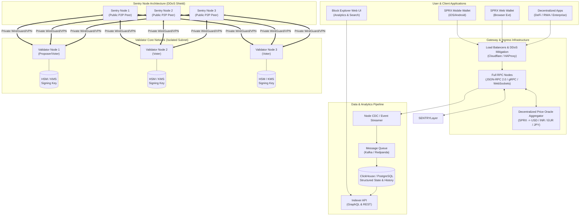
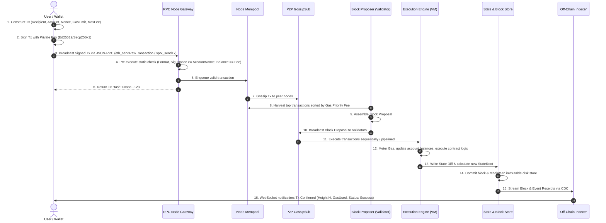
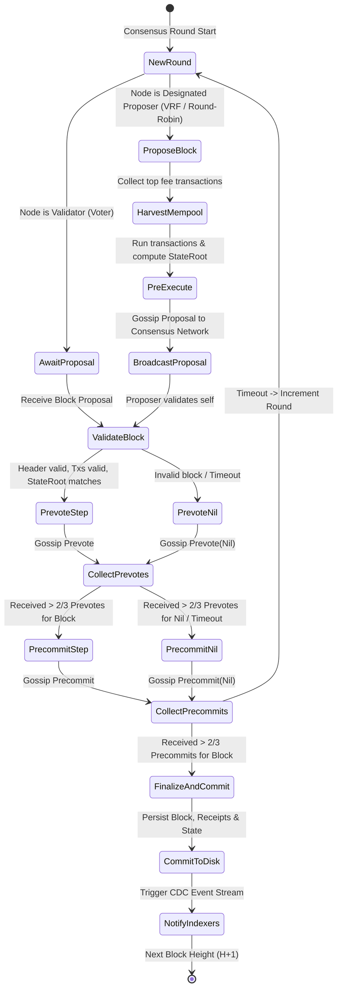
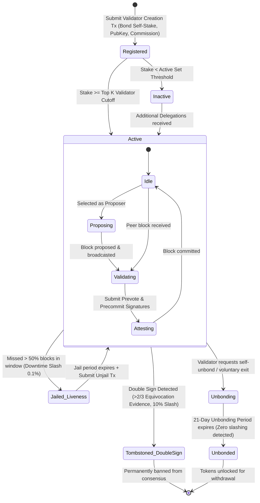
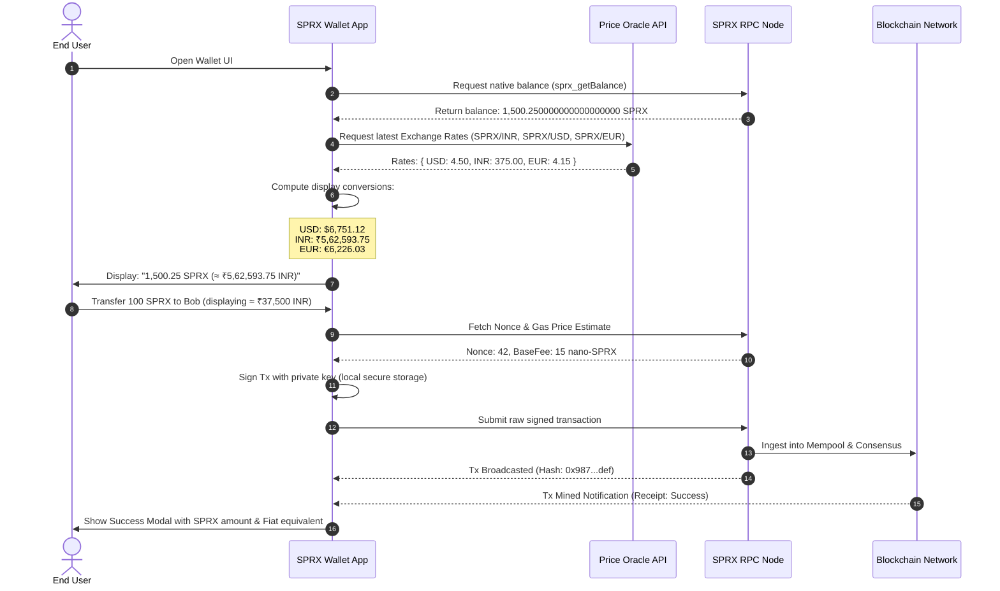
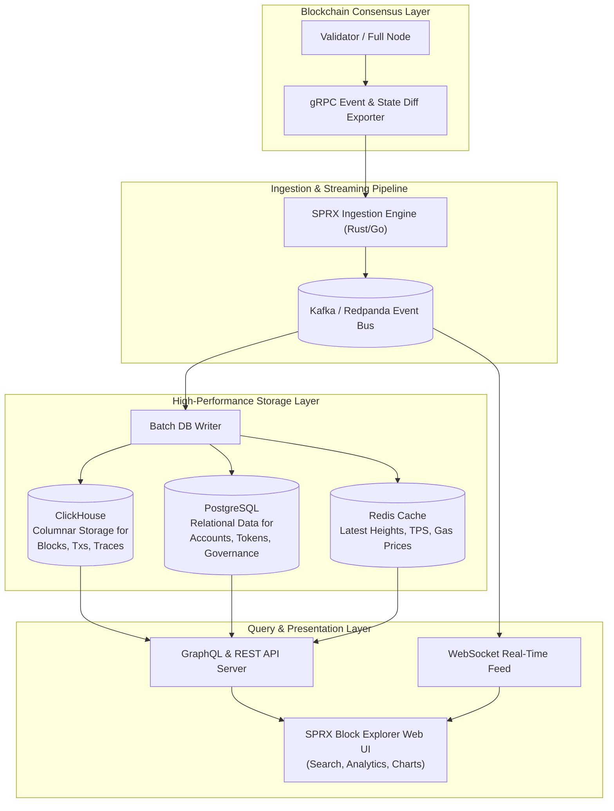
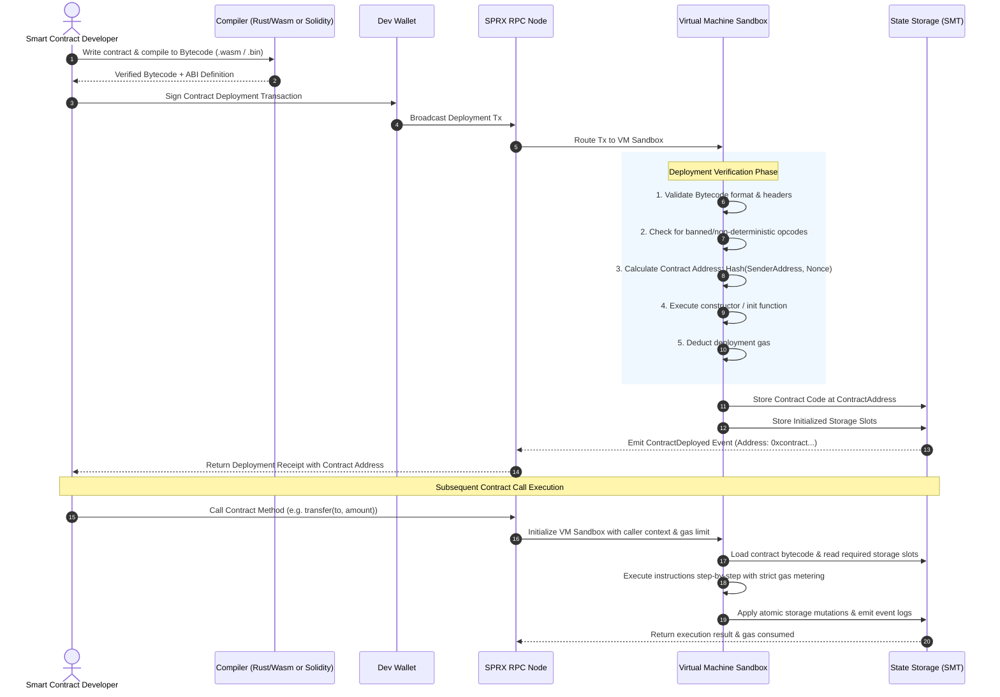

# SPRX Protocol: Master Technical Architecture Specification
**Document Version:** 1.0.0-PROPOSAL  
**Status:** ARCHITECTURE_ONLY (Phase 01)  
**Protocol Name:** SPRX (Scalable Protocol for Real-world X)  
**Native Asset:** SPRX (Floating native cryptocurrency)

---

## 1. Executive Summary & Mission

The **SPRX Protocol** (Scalable Protocol for Real-world X) is engineered as an enterprise-grade, high-throughput, low-latency, deterministic-finality Layer-1 / Sovereign Modular blockchain platform designed specifically for real-world asset tokenization, decentralized finance (DeFi), global payments, supply chain provenance, and enterprise decentralized applications (dApps).

SPRX couples Byzantine Fault Tolerant Proof-of-Stake (BFT-PoS) consensus with an isolated, gas-metered execution environment, modular storage tiers, and a dedicated multi-currency display abstraction layer. The native cryptographic asset is **SPRX**, a floating market-driven utility and staking token with 18 decimal places of sub-unit precision ($10^{18}$ base units / `atto-SPRX`).

---

## 2. Core Architectural Principles

All architectural decisions in SPRX adhere strictly to the following fundamental principles:

1. **Security Over Convenience**: Cryptographic soundness, state isolation, and formal invariants take absolute precedence over rapid feature introduction.
2. **Proven Cryptography Only**: Exclusively standard, peer-reviewed, production-hardened primitives (Ed25519, Secp256k1, BLS12-381, SHA-256, Blake3, Keccak-256). Zero custom or untested cryptographic schemes.
3. **Battle-Tested Consensus Engine**: Adoption of proven BFT consensus principles (e.g., CometBFT / HotStuff state-machine replication) with deterministic, single/two-step finality and mathematical safety bounds.
4. **Strict Modularity & Decoupling**: Clean boundaries separating the consensus engine, execution virtual machine, state storage, mempool, and P2P transport via standardized interfaces (e.g., ABCI++ or equivalent modular abstractions).
5. **Deterministic Execution**: Zero nondeterminism (no system clocks in execution, no floating-point arithmetic on-chain, fixed gas metering for all computational instructions and state operations).
6. **Horizontal & Vertical Scalability**: Pipelined block execution, state commitment decoupling, compact block propagation, and hierarchical storage indexing.
7. **Clear On-Chain vs. Off-Chain Separation**: Heavy compute, fiat price feeds, complex data querying, search indexing, and user-facing presentation remain strictly off-chain or oracle-mediated.
8. **Minimal Trust Assumptions & Verifiability**: Light-client proofs (Merkle/Polynomial proofs) allow any mobile or embedded client to verify state without executing full historical blocks.
9. **Zero Hardcoded Secrets & Robust Key Hygiene**: Strict key isolation, hardware security module (HSM) integration for validators, and zero environmental key leakage.
10. **Universal Currency Display Decoupling**: The native asset (SPRX) floats freely on global markets. Wallets, dApps, and explorers consume cryptographically authenticated off-chain price oracle feeds to project balances in global fiat currencies (INR, USD, EUR, GBP, JPY) without contaminating consensus layer state.

---

## 3. The 20 Architectural Pillars of SPRX

```
+--------------------------------------------------------------------------------------------------+
|                                     SPRX SYSTEM ARCHITECTURE                                     |
+--------------------------------------------------------------------------------------------------+
| [Layer 4: Application & Presentation]                                                            |
|  - Multi-Currency Wallets (Web/Mobile/CLI)  - Web3 Explorer & Analytics  - Enterprise dApps      |
+--------------------------------------------------------------------------------------------------+
| [Layer 3: Query & Indexing Layer]                                                                |
|  - High-Performance Indexers (ClickHouse/PostgreSQL)  - GraphQL & REST APIs  - Price Oracles     |
+--------------------------------------------------------------------------------------------------+
| [Layer 2: Execution & State Machine]                                                             |
|  - Dual Smart Contract Engine (Wasm / EVM)  - State Manager (Jellyfish / SMT)  - Gas Metering    |
+--------------------------------------------------------------------------------------------------+
| [Layer 1: Consensus & Replication]                                                               |
|  - BFT-PoS Engine (Fast Finality)  - Dynamic Validator Set  - Slashing & Staking Modules         |
+--------------------------------------------------------------------------------------------------+
| [Layer 0: Network & Storage Core]                                                                |
|  - libp2p GossipSub v1.1 / Noise Transport  - Dual-Tier Storage (RocksDB/Pebble + Flat Block Log)|
+--------------------------------------------------------------------------------------------------+
```

### Pillar 1: Overall Blockchain Architecture
SPRX is designed as a sovereign, state-machine-replicated Layer-1 blockchain protocol. The system is split into distinct planes:
- **Consensus Plane**: Responsible for total ordering of block proposals, validator voting rounds (Prevote, Precommit), and cryptographic finality.
- **Execution Plane**: Consumes ordered blocks from consensus, validates state transitions deterministically, charges gas, and computes post-execution state root commitments.
- **Data Availability & Storage Plane**: Manages raw immutable block logs, receipts, state trie nodes, and prunable historical snapshots.
- **Gateway & Ingress Plane**: Provides JSON-RPC, gRPC, and WebSocket interfaces to clients with built-in rate-limiting and pre-execution gas estimation.

### Pillar 2: Node Architecture
A node is the fundamental physical unit running the SPRX protocol. Nodes operate in one of four distinct operational profiles:
1. **Validator Node**: Participates in consensus voting and block proposal. Isolated behind sentry nodes; holds private consensus keys protected by HSM/KMS.
2. **Sentry / Edge Node**: Publicly accessible node shielding validators from direct Internet exposure and DDoS attacks, scrubbing P2P traffic.
3. **Full RPC Node**: Maintains current state and recent history; serves client RPC/gRPC/WebSocket queries and transaction ingestion.
4. **Archive Node**: Retains all historical blocks, transactions, receipts, and state tries since genesis for indexers and forensic analytics.

### Pillar 3: Transaction Architecture
Every SPRX transaction is an atomic, cryptographically signed envelope with a strictly defined binary encoding (Protobuf/SSZ) containing:
- `ChainID`: Unique identifier preventing replay attacks across different networks (Mainnet, Testnet, Devnet).
- `Sender`: Account address (derived from public key hash).
- `Nonce`: Monotonically increasing sequence number per account preventing transaction replay.
- `Payload`: Either a native value transfer, staking operation, governance vote, or smart contract invocation.
- `GasLimit`: Maximum computational units the sender authorizes.
- `MaxFeePerGas`: Maximum price per gas unit the sender is willing to pay.
- `PriorityFeePerGas`: Direct validator incentive tip.
- `Signature`: Cryptographic signature (Ed25519 or Secp256k1).

### Pillar 4: Block Architecture
Blocks represent discrete, verifiable packages of state transitions. A block consists of:
- **Block Header**:
  - `Version`: Protocol version.
  - `Height`: Monotonically increasing block number.
  - `Time`: Median time of validator commitments (BFT-Time).
  - `PreviousBlockHash`: SHA-256 / Blake3 hash of the parent block header.
  - `ProposerAddress`: Validator address that generated the proposal.
  - `StateRoot`: Merkle root commitment of the global state after applying all transactions.
  - `TransactionsRoot`: Merkle root of transaction hashes in the block.
  - `ReceiptsRoot`: Merkle root of transaction execution receipts, gas used, and emitted logs.
  - `ConsensusDataHash`: Validator set hash, next validator set hash, and consensus parameters.
  - `EvidenceRoot`: Evidence of double-signing or Byzantine misbehavior included by the proposer.
- **Block Body**:
  - List of verified transactions.
  - Byzantine evidence payloads.
  - Last commit signatures (aggregate or individual validator 2/3+ precommit signatures for block $H-1$).

### Pillar 5: State Management
SPRX state is modeled as an authenticated key-value tree structure using a **Sparse Merkle Tree (SMT)** or **Jellyfish Merkle Tree (JMT)**:
- **Account State**: Address $\rightarrow$ `{ Nonce, Balance, CodeHash, StorageRoot }`.
- **Contract Storage**: ContractAddress + StorageKey $\rightarrow$ `StorageValue`.
- **System State**: Validator registry, bonded stakes, unbonding queues, governance proposals, parameter registries.
- **State Commitments**: A single cryptographic 32-byte hash (`StateRoot`) in the block header uniquely binds the state of the entire universe at that height.

### Pillar 6: Consensus Requirements
- **Algorithm**: Byzantine Fault Tolerant Proof-of-Stake (BFT-PoS) with instantaneous or two-step deterministic finality.
- **Safety**: Tolerates up to $f < N/3$ Byzantine (malicious or arbitrary fault) validator voting power without safety violation (no forks).
- **Liveness**: Makes progress as long as $> 2/3$ of the validator voting power is online and communicating within network synchrony bounds.
- **Block Times**: Target block interval of 1.0 – 2.0 seconds with sub-second finality.

### Pillar 7: Validator Architecture
- **Active Set**: Dynamically selected top $K$ validators (e.g., $K = 100$ to $150$) ranked by total self-bonded and delegated stake.
- **Proposer Election**: Deterministic weighted round-robin or Verifiable Random Function (VRF) proportional to validator voting weight.
- **Slashing Protocol**:
  - *Double-signing / Equivocation*: Automatic, deterministic slash of $5\% - 20\%$ bonded stake, immediate permanent jailing (tombstoning).
  - *Liveness downtime*: Missing $>50\%$ of blocks within a sliding window (e.g., 10,000 blocks) results in a minor fine (e.g., $0.1\%$) and temporary jailing until an unjail transaction is submitted.
- **Validator Security**: Mandatory Sentry Node Architecture and Hardware Security Module (YubiHSM2, Ledger, AWS CloudHSM) for signing keys.

### Pillar 8: P2P Networking
- **Transport**: Encrypted multi-transport layer using libp2p (TCP and QUIC) with Noise Protocol Framework (XX handshake) and TLS 1.3.
- **Peer Discovery**: Kademlia DHT combined with authenticated Discv5 protocol and hardcoded persistent bootnodes.
- **Message Propagation**: GossipSub v1.1 with strict topic-based scoring, message throttling, and peer reputation management to prevent spam.
- **Block Propagation**: Compact block relay (Erlay / BIP-152 style) where nodes only exchange block headers and short transaction IDs, cutting bandwidth consumption by $>80\%$.

### Pillar 9: Cryptography Requirements
- **Account & Consensus Signatures**:
  - `Ed25519`: Ultra-fast, constant-time, collision-resistant signatures for consensus voting and high-performance native accounts.
  - `Secp256k1`: Supported for EVM compatibility and broad hardware wallet interoperability.
  - `BLS12-381`: Optional aggregation support for multi-validator attestations and compact light-client proofs.
- **Hashing**:
  - `Blake3` / `SHA-256`: Internal state hashing, merkle trees, and block hashes.
  - `Keccak-256`: EVM execution sub-module hashing.
- **Zero Custom Cryptography Rule**: Every cryptographic primitive MUST be sourced from audited, standardized libraries (e.g., `ring`, `ed25519-dalek`, `blst`).

### Pillar 10: Storage Architecture
- **Dual-Tier Storage Engine**:
  - **Tier 1 (LSM Key-Value Engine)**: Embedded RocksDB / Pebble / MDBX for state trie nodes, accounts, and fast point-lookups.
  - **Tier 2 (Flat File Append-Only Log)**: Segmented, pre-allocated raw disk files for historical block headers, bodies, and execution receipts.
- **State Pruning**: Full nodes maintain only current state and the last $N$ heights of historical state diffs (e.g., 2 weeks). Archive nodes maintain the entire history.
- **Fast State Sync**: New nodes download the latest verified state snapshot chunks directly from validators, verifying the root hash against consensus before participating in consensus.

### Pillar 11: RPC Architecture
- **Multi-Protocol Interface**:
  - **JSON-RPC 2.0**: Compatible with standard Web3 tooling and wallet integrations.
  - **gRPC / Protocol Buffers**: High-performance binary RPC for backend indexers, validators, and high-frequency trading clients.
  - **WebSocket Server**: Real-time pub/sub for new block headers, pending transactions, and smart contract event logs.
- **Security & Load Balancing**: Tiered rate-limiting, IP reputation, query depth limits, and pre-execution gas bounds.

### Pillar 12: Indexer Architecture
- **Change Data Capture (CDC)**: Nodes stream block events, transaction receipts, and state diffs via gRPC to off-chain indexers.
- **Storage**: Analytical time-series / columnar data store (e.g., ClickHouse for high-throughput analytics, PostgreSQL for relational queries, Elasticsearch for full-text search).
- **Query Layer**: High-performance GraphQL and REST APIs exposing rich querying (token transfers, balance history, contract calls, staking metrics, price histories).

### Pillar 13: Wallet Architecture
- **Hierarchical Deterministic (HD) Wallets**: BIP-39 mnemonic seed phrases with BIP-44 derivation paths (`m/44'/9999'/0'/0/0`).
- **Key Storage**: AES-256-GCM encrypted local keystore files or OS Secure Enclave / Android KeyStore / Hardware Wallets (Ledger, Trezor).
- **Multi-Currency Value Projection**: Wallets fetch real-time exchange rates from decentralized oracle aggregators and display balances natively in INR, USD, EUR, GBP, JPY, and other global currencies while executing transactions in native SPRX.

### Pillar 14: Explorer Architecture
- **Decentralized & Performant Web UI**: Next.js / React frontend querying indexer GraphQL/REST endpoints.
- **Core Features**: Real-time block stream, transaction inspector, contract verification portal, validator performance & uptime tracker, governance dashboard, and token asset directory.
- **Global Currency Switching**: Instant UI toggle allowing users to view gas fees, market capitalization, volume, and account values in their preferred local currency.

### Pillar 15: Smart-Contract Architecture
- **Virtual Machine Engine**:
  - Primary: High-performance **WebAssembly (Wasm)** VM (e.g., Wasmtime / Wasmer) with memory sandboxing, strict metering, and deterministic memory limits.
  - Secondary / Interoperability: **EVM Compatibility Layer** for frictionless porting of Solidity / Vyper contracts.
- **Gas Model**: Deterministic instruction metering with separate charges for CPU execution, memory allocation, and persistent storage read/write.
- **Safety**: Reentrancy guards at the VM level, static bytecode verification on deployment, and memory safety invariants.

### Pillar 16: Governance Architecture
- **On-Chain Governance Lifecycle**: Deposit Phase $\rightarrow$ Voting Phase $\rightarrow$ Timelock Queue $\rightarrow$ Autonomous Execution / Parameter Update.
- **Voting Power**: 1 Staked SPRX = 1 Vote (delegators inherit validator votes unless explicitly voting themselves).
- **Proposal Classes**: Parameter changes, community pool funding, protocol upgrades, and emergency security interventions.
- **Thresholds**: Quorum ($\ge 40\%$), Majority ($\ge 50\%$), Supermajority ($\ge 66.7\%$ for upgrades), and No-With-Veto ($\ge 33.4\%$ to reject malicious proposals and burn deposits).

### Pillar 17: Staking Architecture
- **Delegated Proof-of-Stake**: Token holders delegate SPRX to validators to secure the network.
- **Reward Distribution**: Block rewards (inflation + fee share) calculated per block and distributed proportionally to staked voting power minus validator commission.
- **Unbonding Period**: 21-day unbonding delay (cooling-off period) during which tokens earn no rewards and remain subject to slashing for past infractions.

### Pillar 18: Upgrade Architecture
- **In-Band Coordinated Upgrades**: Governance-approved upgrades trigger at a deterministic block height $H_{upgrade}$.
- **Forkless State Transition**: Nodes execute migration scripts at $H_{upgrade}$, updating internal state schemas seamlessly without chain splits.
- **Proxy Patterns**: Smart contracts utilize standard proxy patterns (ERC-1967 Transparent Proxy / UUPS / Diamond Pattern) for logic upgradeability.

### Pillar 19: Monitoring & Observability Architecture
- **Metrics**: Standard Prometheus endpoint (`/metrics`) exposing 150+ operational metrics (block execution time, P2P peer count, mempool size, disk I/O, consensus round latency).
- **Distributed Tracing & Structured Logs**: JSON-formatted structured logging with log levels (DEBUG, INFO, WARN, ERROR) and OpenTelemetry tracing for transaction lifecycle profiling.
- **Alerting**: Alertmanager rules for validator downtime, missed blocks, memory spikes, and consensus stalls.

### Pillar 20: Security Architecture
- **Defense-in-Depth**: Multi-layered defense covering network perimeter, P2P gossip filtering, VM sandbox isolation, transaction rate-limiting, and consensus quorum integrity.
- **HSM Consensus Key Isolation**: Sentry nodes strip external traffic; validator signing key lives inside HSM with strict anti-double-signing high-water mark databases.
- **Formal Threat Model**: Comprehensive 30+ threat vector matrix with continuous auditing, fuzzing, and bug bounty programs.

---

## 4. Multi-Currency Display Architecture

A fundamental architectural requirement of the SPRX ecosystem is that **SPRX is a floating cryptocurrency** (not pegged to INR or any other fiat currency), yet end-users worldwide must seamlessly view their account balances, transfer values, and transaction fees in their local domestic currencies (INR, USD, EUR, GBP, JPY, etc.).

```
+---------------------------------------------------------------------------------------------------+
|                              GLOBAL MULTI-CURRENCY DISPLAY ARCHITECTURE                           |
+---------------------------------------------------------------------------------------------------+
| [Layer 1: Blockchain Core (Consensus)]                                                            |
|  - All on-chain balances, transfers, and gas fees are denominated purely in SPRX (or atto-SPRX).   |
|  - Absolutely ZERO fiat conversion logic inside consensus execution.                              |
+---------------------------------------------------------------------------------------------------+
                                             |
                                             v
+---------------------------------------------------------------------------------------------------+
| [Layer 2: Decentralized & Off-Chain Oracle Aggregator Network]                                    |
|  - Multi-source price discovery: SPRX/USD, SPRX/INR, SPRX/EUR, USD/INR, USD/EUR, USD/JPY          |
|  - TWAP (Time-Weighted Average Price) & Volume-Weighted Average Calculation                       |
|  - Authenticated Signed Price Feeds published to Indexer & RPC cache with TTL (~30-60s)           |
+---------------------------------------------------------------------------------------------------+
                                             |
                                             v
+---------------------------------------------------------------------------------------------------+
| [Layer 3: Client Presentation Layer (Wallets / Explorer / dApps)]                                 |
|  - User selects currency preference: [INR (₹) | USD ($) | EUR (€) | GBP (£) | JPY (¥)]             |
|  - Formula: FiatValue = (NativeBalance_SPRX * CurrentExchangeRate_SPRX_Fiat)                     |
|  - Real-time conversion displayed alongside exact on-chain SPRX amount.                           |
|  - Localized formatting (e.g., Lakhs/Crores for INR: ₹1,50,000; Standard comma for USD: $1,500.00)|
+---------------------------------------------------------------------------------------------------+
```

---

## 5. Architectural Mermaid Diagrams

### Diagram 1: Complete Ecosystem Architecture


---

### Diagram 2: Node Subsystem Architecture

```mermaid
flowchart LR
    subgraph P2PLayer ["P2P & Transport Layer"]
        DISC["Discovery\n(Discv5 / Kademlia)"]
        GOSSIP["GossipSub v1.1\n(Txs & Blocks)"]
        NOISE["Noise Transport\n(Encrypted TCP/QUIC)"]
    end

    subgraph MempoolSubsystem ["Mempool Engine"]
        TX_VAL["Tx Pre-Validation\n(Signature, Nonce, Balance)"]
        PRIO_QUEUE["Priority Queue\n(Gas-Fee Density Sorting)"]
        EVICT["Eviction & Expiry\nController"]
    end

    subgraph ConsensusSubsystem ["BFT-PoS Consensus Engine"]
        ROUND["Proposer / Round State Machine"]
        VOTE["Prevote & Precommit Collector"]
        FINAL["Finality & Commit Manager"]
    end

    subgraph ExecutionSubsystem ["Execution & State Machine"]
        VM["Virtual Machine\n(Wasm / EVM Sandbox)"]
        GAS["Gas Metering Engine"]
        STATE_MGR["State Transition Manager"]
    end

    subgraph StorageSubsystem ["Dual-Tier Storage Engine"]
        SMT_DB[("State DB (RocksDB/Pebble)\nJellyfish Merkle Tree")]
        BLOCK_LOG[("Flat File Block Store\nAppend-Only Immutable Log")]
        WAL[("Write-Ahead Log\nCrash Recovery")]
    end

    subgraph InterfaceSubsystem ["RPC & Telemetry Interface"]
        JSONRPC["JSON-RPC / WebSockets"]
        GRPC_SRV["gRPC Server"]
        PROM["Prometheus /metrics"]
    end

    P2PLayer <--> MempoolSubsystem
    P2PLayer <--> ConsensusSubsystem
    ConsensusSubsystem --> ExecutionSubsystem
    ExecutionSubsystem <--> StorageSubsystem
    StorageSubsystem <--> InterfaceSubsystem
    MempoolSubsystem --> ConsensusSubsystem
```


---

### Diagram 3: Transaction Lifecycle Flow


---

### Diagram 4: Block Lifecycle Flow


---

### Diagram 5: Validator Lifecycle Flow


---

### Diagram 6: Wallet-to-Node & Multi-Currency Flow


---

### Diagram 7: Explorer & Indexer Flow


---

### Diagram 8: Smart Contract Lifecycle & Execution Flow


---

## 6. Architecture Status & Verification Matrix

| Component | Status | Design Standard | Target Requirement |
| :--- | :--- | :--- | :--- |
| **Consensus Engine** | Specified | BFT-PoS (2-Step Finality) | $< 2.0s$ block time, instant deterministic finality |
| **Execution VM** | Specified | Dual Wasm + EVM Sandbox | Deterministic gas metering, memory-safe isolation |
| **State Storage** | Specified | LSM-Tree + Jellyfish Merkle Tree | Atomic updates, verifiable root proofs, fast state-sync |
| **P2P Transport** | Specified | libp2p + Noise + GossipSub v1.1 | Anti-DoS scoring, compact block propagation |
| **Cryptography** | Specified | Ed25519, Secp256k1, Blake3, SHA-256 | Proven standard libraries only; zero custom algorithms |
| **Currency Display** | Specified | Decoupled Oracle Aggregation | SPRX native float; UI display in INR, USD, EUR, JPY, GBP |
| **Security Architecture**| Specified | HSM Sentry Topology + 30+ Threat Mitigations | Enterprise-grade isolation, zero key leakage |
